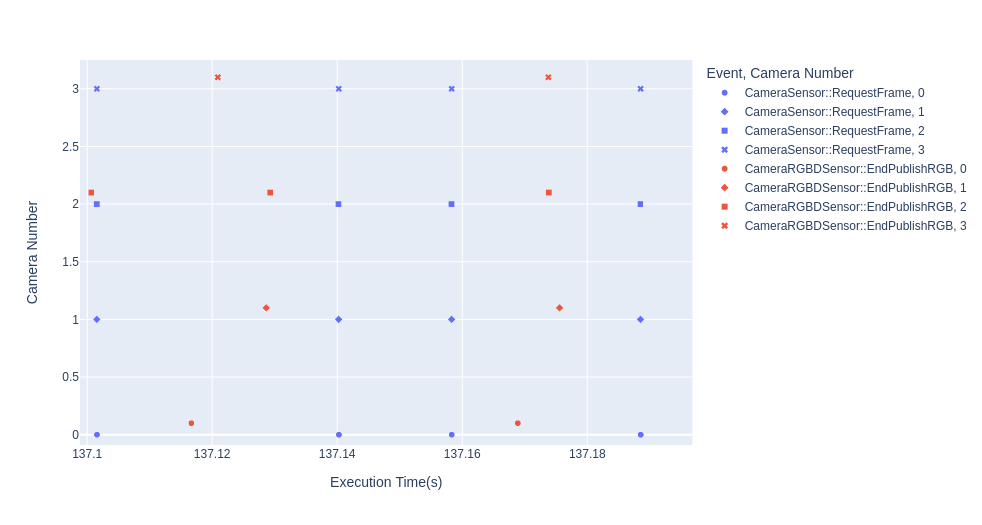

# Testing multiple cameras in o3de-ros 

# Testing PR [14939](https://github.com/o3de/o3de/pull/14939) (most recent)

### RGBD Cameras 
Cached shadows:

```
camera 0, avg : 0.024172 ms std_dev: 0.016395 ms
camera 1, avg : 0.024172 ms std_dev: 0.016396 ms
camera 2, avg : 0.024172 ms std_dev: 0.016395 ms
camera 3, avg : 0.024172 ms std_dev: 0.016396 ms
```

Uncached shadows:
```
camera 0, avg : 0.028684 ms std_dev: 0.022370 ms
camera 1, avg : 0.028684 ms std_dev: 0.022369 ms
camera 2, avg : 0.028684 ms std_dev: 0.022370 ms
camera 3, avg : 0.028684 ms std_dev: 0.022369 ms
```

# Older results
## Testing o3de-development (3 march 2023)
### Depth Only

- Depth only
- 4 camera 30 FPS 640x480 with subscription
We can observe:
- Request frame frequency is not consistent and varies a lot
- Some frames end up without publication at all.
- The main framerate is similar to that requested (around 30 FPS)




```
camera 0, avg : 0.038327 ms std_dev: 0.024011 ms
camera 1, avg : 0.038327 ms std_dev: 0.024011 ms
camera 2, avg : 0.038327 ms std_dev: 0.024009 ms
camera 3, avg : 0.038327 ms std_dev: 0.024011 ms
```

### RGBD 
- RGBD , 4 camera 30 FPS 640x480 with subscription
We can see:
- Request frame is more consistent,
- Every frame is published,
- Depth is published slightly earlier,
- RGB is published before requesting new frame
- The main framerate is lower to that requested (around 13 FPS)


```
camera 0, avg : 0.092022 ms std_dev: 0.041840 ms
camera 1, avg : 0.092022 ms std_dev: 0.041841 ms
camera 2, avg : 0.092022 ms std_dev: 0.041835 ms
camera 3, avg : 0.092022 ms std_dev: 0.041841 ms
```

### RGB

Similar performance to RGBD with expected downgrade to depth readout.


```
camera 0, avg : 0.085233 ms std_dev: 0.036236 ms
camera 1, avg : 0.085233 ms std_dev: 0.036239 ms
camera 2, avg : 0.085233 ms std_dev: 0.036241 ms
camera 3, avg : 0.085233 ms std_dev: 0.036238 ms
```

### One RGB


```
camera 0, avg : 0.046309 ms std_dev: 0.018214 ms
```


